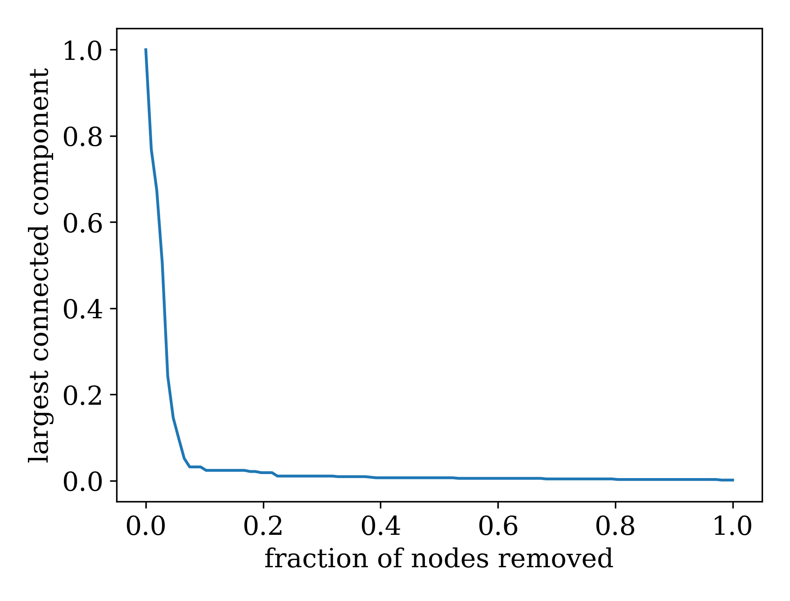

# Citing this package
This is the code used for the paper:
*"DomiRank Centrality: revealing structural fragility of complex networks via node dominance"*, 
by **Engsig et. al.**

## If you use this repository, please cite the following manuscript.
https://www.nature.com/articles/s41467-023-44257-0#citeas

Engsig, M., Tejedor, A., Moreno, Y. et al. *DomiRank Centrality reveals structural fragility of complex networks via node dominance*. Nat Commun **15**, 56 (2024). https://doi.org/10.1038/s41467-023-44257-0

# NetworkX
This package is compatible with the NetworkX library. Currently, I am working on integrating 
DomiRank to be available directly via NetworkX API. The Pull-Request is linked hereunder:

https://github.com/networkx/networkx/pull/7443

If you want this to get integrated directly into the NetworkX API, please go give a like or sad 
emoji ): directly to the PR to give it more attention.


# Installing DomiRank on your machine
If you are using **arch-linux** you can directly install via:

```
bash install archLinux.sh
```

For **any OS** you can install via the simple command:

```
pip install -e .
```


## Setting up a virtual environment using python-venv
I highly recommend setting up a virtual environment using python-venv.

The first step is to initialize the virtual environment: 

```
python -m venv domirank_venv
```

Now we activate our virtual environment:

```
source domirank_venv/bin/activate
```

Then we install **domirank** library via pyinstall (this will automatically install all dependencies) (this will automatically install all dependencies) (this will automatically install all dependencies) (this will automatically install all dependencies).

```
python setup.py
```

Thereafter you should be ready to use all the files in the domirank.py module (;
If you want to activate the same virutal-environment at other time, you simply navigate to the directory, and type:

$source domirank_venv/bin/activate


# Sample *main.py* script.
For the script, here are a few things to play around with:

1. To use any network simply save the edgelist in Networks and change the networkName variable to suit the naming of your edgelist. You can also generate synthetic networks similarly to the *commented* network generation in the script.
Change G to any network you want (networkx), or import any network and turn it into a scipy.sparse.csr_array() data structure. This will make sure the code runs flawlessly. 

2. In the DomiRank.domirank() function, if you only pass the adjacency matrix (sparse) as an input, it will automatically compute the optimal sigma. However, you can also pass individual arguments, in order to create domiranks that will damage the network such that it is difficult to recover from, or, to simply, understand dynamics for high sigma (competition).

3. Finally, the network can be attacked according to any strategy, using the following function. domirank.network_attack_sampled(GAdj, attackStrategy), where GAdj is the adjacency matrix as a scipy.sparse.csr_array(), and the attack strategy is the ordering of the node removals (node-id). The node-id ordering can be generated from the centrality array by using the function domirank.generate_attack(centrality), where, centrality is an array of the centrality-distribution, ordered from (least to greatest in terms of node-id).

Feel free to contact me at: marcus.w.engsig@gmail.com

Enjoy! ( ;

By: Marcus Engsig


## Sample output for a crime network



