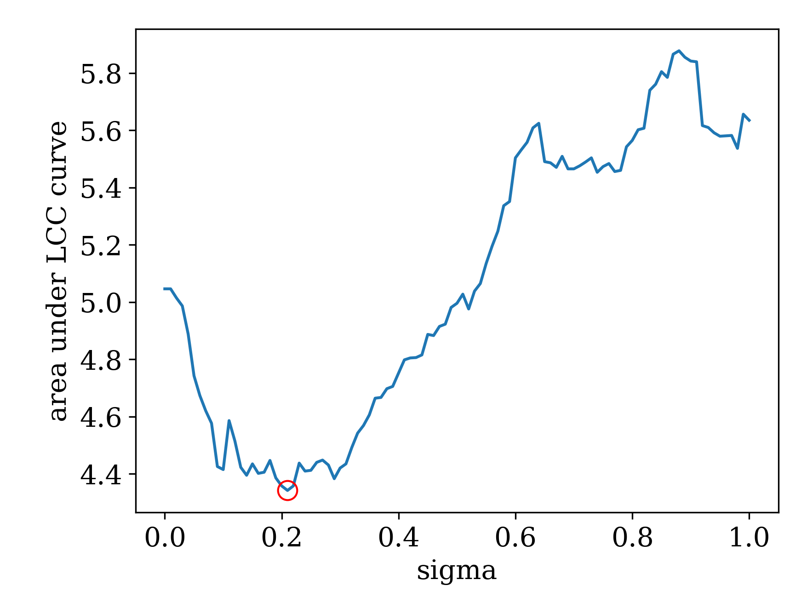

This is the code used for the paper:
"DomiRank Centrality: revealing structural fragility of complex networks via node dominance" 
by 
Engsig et. al.

If you use this repository, please cite the following manuscript. --> 
https://www.nature.com/articles/s41467-023-44257-0#citeas

Engsig, M., Tejedor, A., Moreno, Y. et al. DomiRank Centrality reveals structural fragility of complex networks via node dominance. Nat Commun 15, 56 (2024). https://doi.org/10.1038/s41467-023-44257-0

------------------------------------------------------------------------------------------------
NEWS! Find the DomiLab server, a playground for DomiRank and other centralities at:
https://domilab.tii.ae

Find the source code for the DomiLab server so that you can run it locally at:
https://github.com/tiiuae/domilab

NEWS!
I will be doing an implementation of DomiRank for the Networkx API very soon!

------------------------------------------------------------------------------------------------
In order to run the following code please in your terminal:

First we set up a virutal environment using python-venv:

$python -m venv domirank

Now we activate our virtual environment:

$source domirank/bin/activate

Then we install the required libraries.

$pip install -r requirements.txt

Thereafter you should be ready to use all the files in the domirank.py module (;
If you want to activate the same virutal-environment at other time, you simply navigate to the directory, and type:

$source domirank/bin/activate

For the script, here are a few things to play around with:

Change G to any network you want (networkx), or import any network and turn it into a scipy.sparse.csr_array() data structure. This will make sure the code runs flawlessly. 

Moreover, in the domirank.domirank() function, if you only pass the adjacency matrix (sparse) as an input, it will automatically compute the optimal sigma. However, you can also pass individual arguments, in order to create domiranks that will damage the network such that it is difficult to recover from, or, to simply, understand dynamics for high sigma (competition).

Finally, the network can be attacked according to any strategy, using the following function. domirank.network_attack_sampled(GAdj, attackStrategy), where GAdj is the adjacency matrix as a scipy.sparse.csr_array(), and the attack strategy is the ordering of the node removals (node-id). The node-id ordering can be generated from the centrality array by using the function domirank.generate_attack(centrality), where, centrality is an array of the centrality-distribution, ordered from (least to greatest in terms of node-id).

To see the latest version, please see the updated version: https://github.com/mengsig/DomiRank

Or, feel free to contact me at: marcus.w.engsig@gmail.com

Enjoy! (:

By: Marcus Engsig

------------------------------------------------------------------------------------------------
Sample Output for the crime network (Crime_Gcc.txt):

